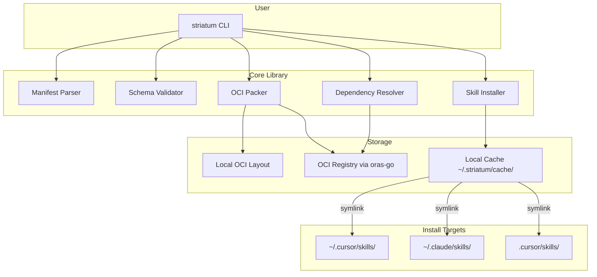

# Striatum -- MVP Specification

## 1. Vision

Striatum is an OCI-native CLI and library for packaging, versioning, and
distributing AI artifacts using standard container registries.

Today, AI logic (prompts, skills, RAG configs, guardrails) lives in scattered
Git repos and text files with no versioning, no dependency tracking, and no
security scanning. Striatum treats AI logic like container images: immutable,
versioned, dependency-aware artifacts that can be pushed to and pulled from any
OCI-compliant registry (Quay.io, Artifactory, ECR, a local
`registry:2` container, or even a plain directory on disk).

## 2. MVP Scope

**In scope:**

- CLI tool (`striatum`) written in Go
- Artifact manifest format (`artifact.json`)
- OCI packaging via `oras-go/v2`
- Push/pull to any OCI-compliant registry
- Install/uninstall skills into Cursor and Claude Code via symlinks
- Transitive dependency resolution
- Works locally -- no Kubernetes required

**Out of scope (future):**

- Security scanning (prompt injection, PII detection)
- RHOAI dashboard integration (Skill Catalog UI)
- Kubernetes operator for syncing artifacts
- Lock files
- Version range constraints (semver ranges)
- Certified Content subscriptions

## 3. Why OCI?

Enterprises already run OCI registries. By building on OCI, Striatum gets
content-addressable storage, tagging, authentication, replication, audit
logging, and garbage collection for free. No new infrastructure to deploy or
approve. The same Quay that stores container images can store AI skills.

OCI is becoming the universal packaging format: Helm charts, Wasm modules,
Sigstore signatures, and Flux configs all use it. ORAS (OCI Registry As
Storage) was purpose-built for this use case.

## 4. Artifact Manifest (`artifact.json`)

The manifest uses a Kubernetes-style `kind` field so the format can be extended
to artifact types beyond skills without breaking changes.

### Schema

```json
{
  "apiVersion": "striatum.dev/v1alpha1",
  "kind": "Skill",
  "metadata": {
    "name": "kubeflow-pipelines-review",
    "version": "1.0.0",
    "description": "Review Kubeflow Pipelines changes across backend, SDK, and UI.",
    "authors": ["hbelmiro"],
    "license": "Apache-2.0",
    "tags": ["code-review", "kubeflow", "pipelines"]
  },
  "spec": {
    "entrypoint": "SKILL.md",
    "files": [
      "SKILL.md",
      "kfp-review-checklist.md"
    ]
  },
  "dependencies": [
    {
      "name": "go-code-review",
      "version": "1.0.0",
      "registry": "localhost:5000/skills"
    },
    {
      "name": "python-code-review",
      "version": "1.0.0",
      "registry": "localhost:5000/skills"
    }
  ]
}
```

### Field Reference

| Field | Required | Description |
| --- | --- | --- |
| `apiVersion` | yes | Schema version. MVP uses `striatum.dev/v1alpha1`. |
| `kind` | yes | Artifact type. MVP supports `Skill`. Extensible to `VectorIndex`, `ModelAdapter`, `GuardrailConfig`, etc. |
| `metadata.name` | yes | Unique artifact name. |
| `metadata.version` | yes | Semver version string. |
| `metadata.description` | no | Human-readable description. |
| `metadata.authors` | no | List of author identifiers. |
| `metadata.license` | no | SPDX license identifier. |
| `metadata.tags` | no | Freeform tags for discoverability. |
| `spec.entrypoint` | yes | Primary file of the artifact. |
| `spec.files` | yes | All files included in the artifact. |
| `dependencies` | no | List of dependency artifacts. Omit or use `[]` if none. |
| `dependencies[].name` | yes | Name of the dependency artifact. |
| `dependencies[].version` | yes | Exact version of the dependency. |
| `dependencies[].registry` | no | Registry where the dependency lives. Defaults to the same registry as the parent. |

## 5. OCI Packaging Model

An artifact maps to an OCI image manifest as follows:

- **Config blob:** The `artifact.json` file.
  Media type: `application/vnd.striatum.artifact.config.v1+json`
- **Layers:** Each file listed in `spec.files`, one layer per file.
  Media type: `application/vnd.striatum.skill.layer.v1.file`

The CLI uses `oras-go/v2` to interact with registries. This means any
OCI-compliant registry works out of the box: Quay.io, Docker Hub, Amazon ECR,
Azure ACR, Google Artifact Registry, or a local `registry:2` container.

For fully offline workflows, `striatum pack` produces a standard OCI Image
Layout directory that can be transferred and loaded without a running registry.

## 6. CLI Commands

### `striatum init`

Scaffold an `artifact.json` in the current directory with interactive prompts
for name, version, and kind.

```text
$ striatum init
Artifact name: my-skill
Version [0.1.0]:
Kind [Skill]:
Created artifact.json
```

### `striatum validate`

Validate the local `artifact.json`: check schema correctness, verify that all
files in `spec.files` exist on disk, and (when `--check-deps` is passed)
verify that all dependencies -- including transitive ones -- exist in the
registry.

```text
$ striatum validate
artifact.json is valid.
All files referenced in spec.files exist.

$ striatum validate --check-deps
Resolving dependency tree...
  go-code-review@1.0.0 ✓
  python-code-review@1.0.0 ✓
    review-shared@1.0.0 ✓  (transitive)
All dependencies resolved.
```

### `striatum pack`

Bundle the artifact into a local OCI Image Layout directory.

```text
$ striatum pack
Packed artifact to .striatum/oci-layout/
```

### `striatum push <reference>`

Push the artifact to an OCI registry.

```text
$ striatum push localhost:5000/skills/kubeflow-pipelines-review:1.0.0
Pushing kubeflow-pipelines-review:1.0.0...
  Uploaded SKILL.md (2.1 KB)
  Uploaded kfp-review-checklist.md (1.4 KB)
  Uploaded artifact.json (config)
Pushed to localhost:5000/skills/kubeflow-pipelines-review:1.0.0
```

### `striatum pull <reference>`

Raw download of an artifact and all its transitive dependencies to a local
directory. Intended for scripting, CI, and offline transfer. Each artifact is
placed in its own sibling directory, mirroring the original layout so that
relative path references between artifacts (e.g., `../review-shared/checklist.md`)
work without modification.

```text
$ striatum pull localhost:5000/skills/kubeflow-pipelines-review:1.0.0
Pulling kubeflow-pipelines-review@1.0.0...
Resolving dependencies...
  Pulling go-code-review@1.0.0...
  Pulling python-code-review@1.0.0...
    Pulling review-shared@1.0.0... (transitive)
Pulled 4 artifacts to ./kubeflow-pipelines-review/

$ tree kubeflow-pipelines-review/
kubeflow-pipelines-review/
├── kubeflow-pipelines-review/
│   ├── artifact.json
│   ├── SKILL.md
│   └── kfp-review-checklist.md
├── go-code-review/
│   ├── artifact.json
│   └── SKILL.md
├── python-code-review/
│   ├── artifact.json
│   └── SKILL.md
└── review-shared/
    ├── artifact.json
    ├── general-review-requirements.md
    ├── go-review-checklist.md
    ├── python-review-checklist.md
    ├── severity-rubric.md
    └── output-template.md
```

All artifacts (including the requested one) are placed as sibling
subdirectories inside the output directory. This preserves relative path
references between artifacts (e.g., `../review-shared/checklist.md`).

Use `--output <dir>` to control the destination (defaults to `./<artifact-name>/`).

### `striatum install <reference>`

Pull an artifact from a registry and install it (with all transitive
dependencies) into the AI coding agent skills directories so that Cursor,
Claude Code, and other compatible tools can discover and use it immediately.

Installation is done via symlinks, following the same approach as the installer
in [hbelmiro/ai-skills](https://github.com/hbelmiro/ai-skills). Artifacts are
first downloaded to a local cache (`~/.striatum/cache/`), then symlinked into
the target skills directories.

**`--target` flag** controls where skills are installed:

- `all` (default) -- installs to all supported targets via symlinks:
  `~/.cursor/skills/`, `~/.claude/skills/`, and any other compatible
  directories. The primary copy lives in the cache; all targets get symlinks.
- `cursor` -- installs only to `~/.cursor/skills/`
- `claude` -- installs only to `~/.claude/skills/`

**`--project <path>`** installs to the project-level directory instead of the
user-level (global) directory. For example, `--project .` installs to
`.cursor/skills/` in the current project.

**`--force`** replaces conflicting symlinks (never overwrites real directories
or files).

**Version conflicts:** Since `~/.cursor/skills/<name>` is a single symlink, it
can only point to one version at a time. If you try to install a skill that
requires `review-shared@2.0.0` but `review-shared@1.0.0` is already installed
and still needed by another skill, Striatum errors out:

```text
$ striatum install localhost:5000/skills/some-new-skill:1.0.0
Error: review-shared@2.0.0 conflicts with installed review-shared@1.0.0
  (required by kubeflow-pipelines-review)
Upgrade kubeflow-pipelines-review first, or use --force to override.
```

The local cache (`~/.striatum/cache/`) can hold multiple versions side by side.
The conflict only applies to the symlinked install targets where a single
directory name maps to one version.

```text
$ striatum install localhost:5000/skills/kubeflow-pipelines-review:1.0.0
Installing kubeflow-pipelines-review@1.0.0...
  Installing dependency go-code-review@1.0.0...
  Installing dependency python-code-review@1.0.0...
    Installing dependency review-shared@1.0.0... (transitive)
Installed 4 artifacts:
  ~/.cursor/skills/kubeflow-pipelines-review -> ~/.striatum/cache/kubeflow-pipelines-review@1.0.0
  ~/.cursor/skills/go-code-review -> ~/.striatum/cache/go-code-review@1.0.0
  ~/.cursor/skills/python-code-review -> ~/.striatum/cache/python-code-review@1.0.0
  ~/.cursor/skills/review-shared -> ~/.striatum/cache/review-shared@1.0.0
  ~/.claude/skills/kubeflow-pipelines-review -> ~/.striatum/cache/kubeflow-pipelines-review@1.0.0
  ~/.claude/skills/go-code-review -> ~/.striatum/cache/go-code-review@1.0.0
  ~/.claude/skills/python-code-review -> ~/.striatum/cache/python-code-review@1.0.0
  ~/.claude/skills/review-shared -> ~/.striatum/cache/review-shared@1.0.0

$ striatum install --target cursor --project . localhost:5000/skills/go-code-review:1.0.0
Installed 1 artifact:
  .cursor/skills/go-code-review -> ~/.striatum/cache/go-code-review@1.0.0
```

**`--reinstall-all`** replays all entries from the install tracking database.
Useful after a machine migration or cache rebuild.

### `striatum uninstall <name>`

Remove a previously installed skill and any orphaned dependencies (dependencies
no longer needed by any other installed skill). Mirrors the uninstall logic
from [hbelmiro/ai-skills](https://github.com/hbelmiro/ai-skills).

```text
$ striatum uninstall kubeflow-pipelines-review
Removed kubeflow-pipelines-review
Removed go-code-review (orphaned dependency)
Removed python-code-review (orphaned dependency)
Removed review-shared (orphaned dependency)
```

### `striatum inspect <reference>`

Display the manifest and metadata of a remote artifact without downloading it.

```text
$ striatum inspect localhost:5000/skills/kubeflow-pipelines-review:1.0.0
Name:         kubeflow-pipelines-review
Version:      1.0.0
Kind:         Skill
Description:  Review Kubeflow Pipelines changes across backend, SDK, and UI.
Entrypoint:   SKILL.md
Files:        SKILL.md, kfp-review-checklist.md
Dependencies:
  - go-code-review@1.0.0
  - python-code-review@1.0.0
```

## 7. Install Tracking

Striatum maintains a local database at `~/.striatum/installed.yaml` to track
which artifacts are installed, where, and at what version. This enables:

- `striatum uninstall` to know what to remove and which deps are orphaned
- `striatum install --reinstall-all` to replay all installations (e.g., after
  a machine migration or cache rebuild)
- Status tracking (`ok` / `error`) with error messages for failed installs

The database schema follows the same pattern as the installer in
[hbelmiro/ai-skills](https://github.com/hbelmiro/ai-skills):

```yaml
entries:
  - skill: kubeflow-pipelines-review
    version: "1.0.0"
    registry: localhost:5000/skills
    target: all
    status: ok
    last_error: null
    updated_at: "2026-03-16T12:00:00Z"
  - skill: go-code-review
    version: "1.0.0"
    registry: localhost:5000/skills
    target: cursor
    project_path: /home/user/my-project
    status: ok
    last_error: null
    updated_at: "2026-03-16T12:00:01Z"
```

## 8. Dependency Resolution

The MVP implements transitive dependency resolution. When validating, pulling,
or installing an artifact, Striatum walks the full dependency tree:

1. Read the artifact's `dependencies` from its manifest.
2. For each dependency, fetch its manifest from the registry.
3. Recursively resolve that dependency's own dependencies.
4. Detect cycles (error if A depends on B depends on A).
5. Return the full flattened set of artifacts to fetch.

Multiple versions of the same dependency can coexist. Each version is stored
independently in the cache (e.g., `review-shared@1.0.0` and
`review-shared@2.0.0`), so there is no conflict. When two artifacts depend on
the same dependency at the same version, it is fetched only once.

```text
kubeflow-pipelines-review@1.0.0
├── go-code-review@1.0.0
│   └── review-shared@1.0.0
└── python-code-review@1.0.0
    └── review-shared@1.0.0  (already resolved, skipped)
```

Lock files are deferred to a future release.

## 9. Architecture



## 10. Project Structure

```text
striatum/
├── cmd/
│   └── striatum/
│       └── main.go              # CLI entrypoint
├── internal/
│   └── cli/                     # Cobra command implementations
│       ├── root.go
│       ├── init.go
│       ├── validate.go
│       ├── pack.go
│       ├── push.go
│       ├── pull.go
│       ├── install.go
│       ├── uninstall.go
│       └── inspect.go
├── pkg/
│   ├── artifact/                # Manifest types and parsing
│   │   ├── manifest.go
│   │   └── validate.go
│   ├── oci/                     # OCI packing, push, pull via oras-go
│   │   ├── pack.go
│   │   ├── push.go
│   │   ├── pull.go
│   │   └── inspect.go
│   ├── resolver/                # Transitive dependency resolution
│   │   └── resolver.go
│   └── installer/               # Skill installation and symlink management
│       ├── installer.go
│       ├── targets.go
│       └── db.go
├── docs/
│   └── MVP.md                   # This document
├── .github/
│   ├── dependabot.yml
│   └── workflows/
│       ├── codeql.yml
│       ├── go-lint.yml
│       ├── go-test.yml
│       └── markdown-lint.yml
├── .pre-commit-config.yaml
├── .markdownlint.json
├── go.mod
└── go.sum
```

## 11. Task Breakdown

### Milestone 1 -- Project Foundation

- **1.1** Create `docs/MVP.md` (this document).
- **1.2** Define Go project structure (`cmd/`, `internal/`, `pkg/`).
- **1.3** Set up CLI framework with Cobra.
- **1.4** Add `.gitignore`, `README.md`, `LICENSE` (Apache-2.0).

### Milestone 2 -- Artifact Schema and Validation

- **2.1** Define `artifact.json` Go types in `pkg/artifact/`.
- **2.2** Implement JSON Schema validation.
- **2.3** Implement `striatum init` command.
- **2.4** Implement `striatum validate` command (local checks: schema + files).

### Milestone 3 -- OCI Packaging

- **3.1** Integrate `oras-go/v2` dependency.
- **3.2** Implement `striatum pack` (local OCI layout).
- **3.3** Implement `striatum push`.
- **3.4** Implement `striatum pull` (raw download to directory, sibling layout).
- **3.5** Implement `striatum inspect`.

### Milestone 4 -- Transitive Dependency Resolution

- **4.1** Implement dependency tree walker (recursive resolution via registry
  lookups, cycle detection).
- **4.2** Integrate transitive resolution into `striatum validate --check-deps`.
- **4.3** Integrate transitive resolution into `striatum pull` (fetch artifact
  and all dependencies).

### Milestone 5 -- Skill Installation

- **5.1** Implement local cache management (`~/.striatum/cache/`).
- **5.2** Implement install target discovery and symlink creation
  (`pkg/installer/`), porting the logic from
  [hbelmiro/ai-skills `src/install.py`](https://github.com/hbelmiro/ai-skills/blob/main/src/install.py).
- **5.3** Implement `striatum install` command with `--target` (all, cursor,
  claude) and `--project` flags.
- **5.4** Implement version conflict detection on install (error when a
  different version of a dependency is already installed and needed by another
  skill; `--force` to override).
- **5.5** Implement install tracking database (`~/.striatum/installed.yaml`).
- **5.6** Implement `striatum uninstall` command with orphaned dependency
  cleanup.

### Milestone 6 -- Polish and Release

- **6.1** Add `--help` docs and usage examples for all commands.
- **6.2** Write integration tests with a local OCI registry
  (`distribution/distribution`).
- **6.3** Create a demo: package the `kubeflow-pipelines-review` skill (with
  its `go-code-review` and `python-code-review` dependencies), push to a local
  registry, install into Cursor/Claude, then uninstall cleanly.
